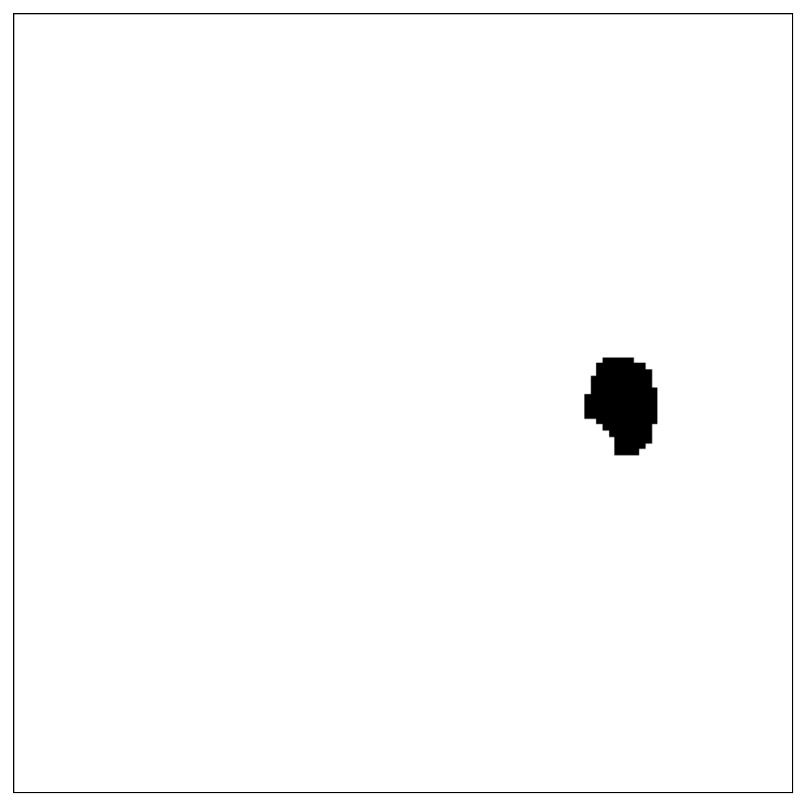
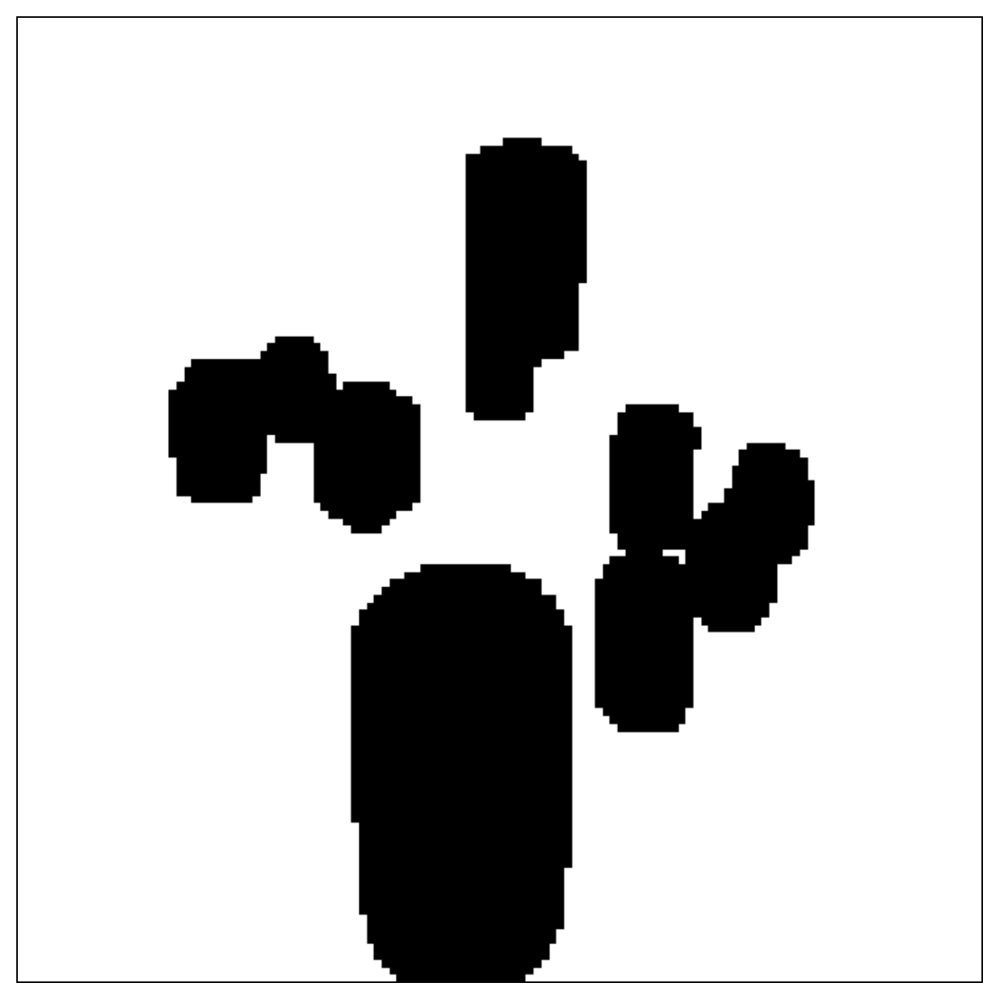
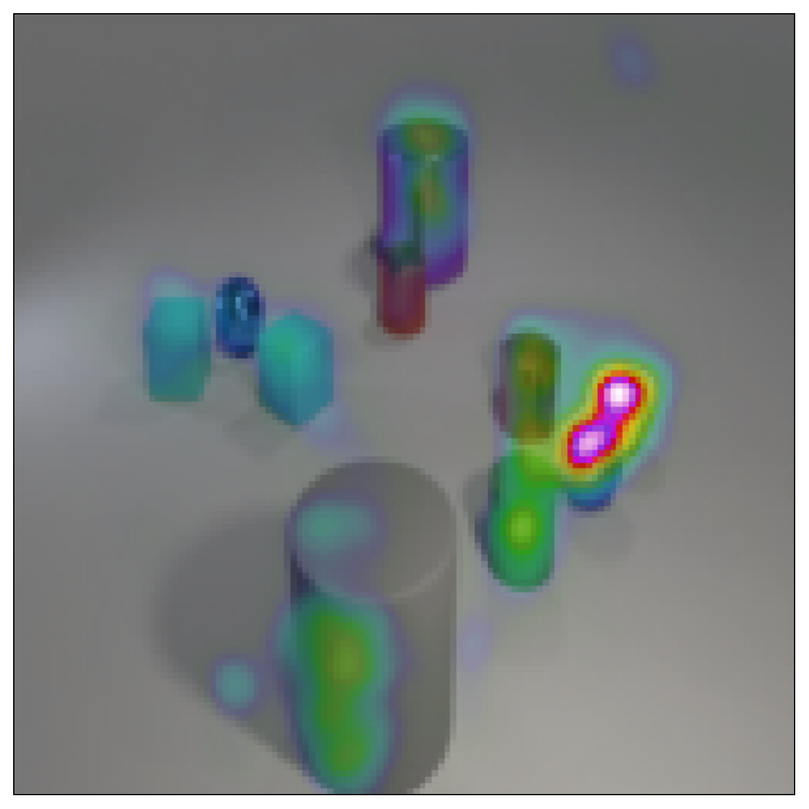
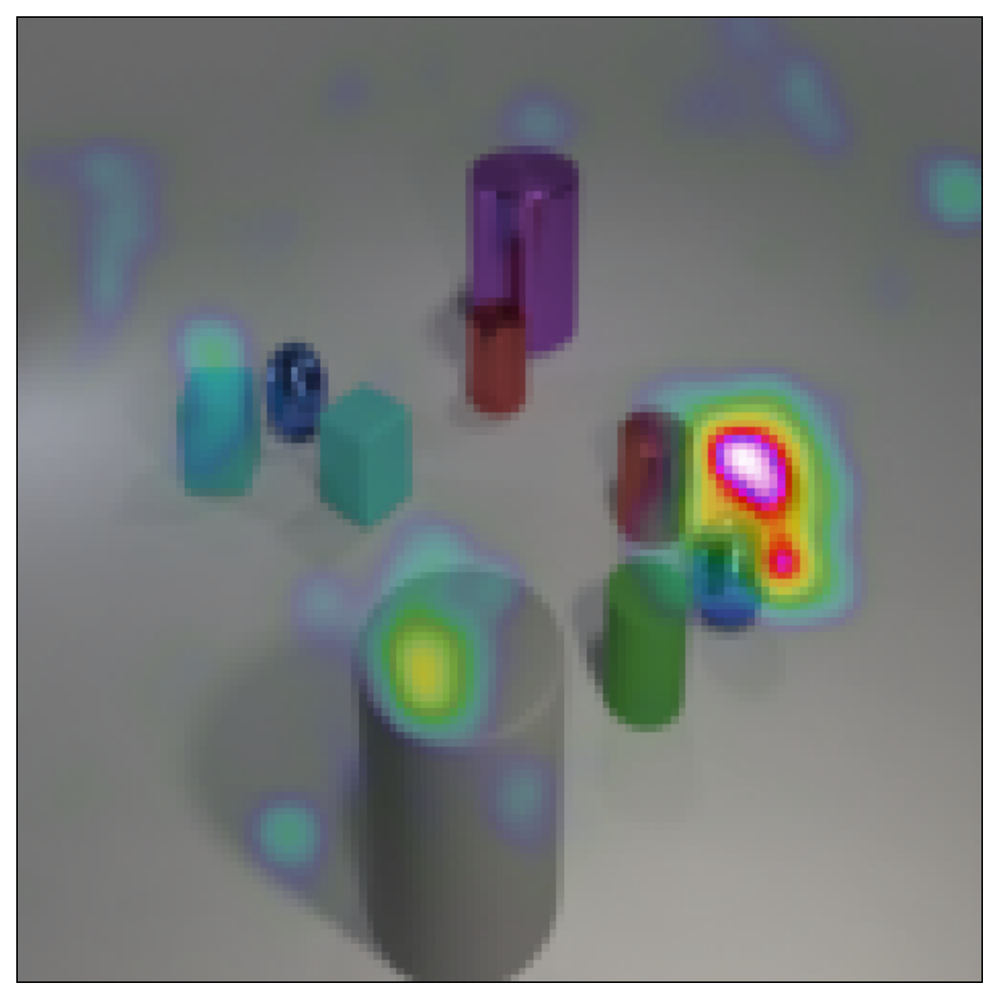

# *simply*-CLEVR Dataset

The **_simply_-CLEVR dataset** aims to provide a benchmark dataset that can be used for transparent quantitative evaluation of explanation methods (aka heatmaps/XAI methods). 

It is made of simple Visual Question Answering (VQA) questions, which are derived from the original [CLEVR task](https://cs.stanford.edu/people/jcjohns/clevr/), and where each question is accompanied by two Ground Truth Masks that serve as a basis for evaluating explanations on the input image.

The **_simply_-CLEVR dataset** was introduced in the paper [Towards Ground Truth Evaluation of Visual Explanations, Osman et al. 2020 arXiv:2003.07258](https://arxiv.org/pdf/2003.07258.pdf). Further, in this paper several explanation methods were tested against the *simply*-CLEVR benchmark: **Layer-wise Relevance Propagation (LRP)**, **Integrated Gradients (IG)** and **Gradient × Input (GI)**.

|Question/Answer   | Image  | One Object Mask | All Objects Mask  |
|:--------------------:|:-----------------------------------------:|:-----------------------------------------:|:-----------------------------------------:|
| **What is the small <br> yellow sphere made of?** <br> *metal*  |         |     |     |
| **Method**  | **LRP**  | **IG**  | **GI**  | 
| Heatmap |     |     |     |


## I. Dataset Description

The **_simply_-CLEVR dataset** consists of **39,761 questions** and **10,000 images** (i.e. there are approximately 4 questions per image). 

You can download the dataset from the [releases](https://github.com/ahmedmagdiosman/simply-clevr-dataset/releases) section of this repository.


## II. Dataset Generation

For reproducibility and to facilitate further work, we also provide the code to generate the *_simply-CLEVR_* dataset. Though note that if you want to only *use* the released version of the dataset you can skip the following generation steps.

Our code is based on the original [CLEVR dataset generator](https://github.com/facebookresearch/clevr-dataset-gen/).

### Prerequisites

To minimize the amount of prerequisites, all generation tasks run inside containers using [Singularity](https://sylabs.io/singularity/). So this is the only requirement to run the code.
 Here is a [quick start guide](https://sylabs.io/guides/3.3/user-guide/quick_start.html).

### Step 1: Generating Images

Please refer to the README in the `image_generation` directory.

### Step 2: Generating Questions

Please refer to the README in the `question_generation` directory.

### Step 3: Generating Ground Truth Masks

Please refer to the README in the `eval` directory.  
The ground truth generation also includes the resizing of the masks, in case your model takes input images of a different size than the original CLEVR images (the original CLEVR images have size 320x480).
In our released *simply*-CLEVR dataset, we resized the masks to 128x128 (since the Relation Network model we use for generating heatmaps takes input images of size 128x128).


## III. Heatmap Generation

We will release the code to generate heatmaps on *simply*-CLEVR and CLEVR, for different explanation methods, and using a trained Relation Network model in a separate repository.  
(The link will be added upon paper acceptance)


## IV. Heatmap Evaluation.

The code to evaluate heatmaps is currently available as a stand-alone Python [gist](https://gist.github.com/ArrasL/0bc02ef98e369f861aec40145a58e356).  
(In the future we plan to automatize the evaluation process for more convenience, and integrate it in the present repository's `eval` directory)


## Citation

If you find our dataset or code useful, please cite:

```
@article{Osman_etal:2020,
    title     = {{Towards Ground Truth Evaluation of Visual Explanations}},
    author    = {Ahmed Osman and Leila Arras and Wojciech Samek},
    journal   = {arXiv:2003.07258},
    year      = {2020},
    url       = {https://arxiv.org/pdf/2003.07258.pdf}
}
```

