# CLEVR-XAI: A Benchmark Dataset for Evaluating XAI

**CLEVR-XAI** aims to provide a benchmark dataset for the quantitative evaluation of XAI explanations (aka heatmaps) in computer vision.

It is made of visual question answering (VQA) questions, which are derived from the original [CLEVR task](https://cs.stanford.edu/people/jcjohns/clevr/), and where each question is accompanied by several ground truth (GT) masks that can be used as a realistic, selective and controlled testbed for the evaluation of heatmaps on the input image.

**CLEVR-XAI** was introduced in the paper [arXiv:2003.07258](https://arxiv.org/abs/2003.07258). Furthermore in this paper several XAI methods were tested against the CLEVR-XAI benchmark, in particular Layer-wise Relevance Propagation (LRP), Integrated Gradients, Guided Backprop, Guided Grad-CAM, SmoothGrad, VarGrad, Gradient, Gradient×Input, Deconvnet and Grad-CAM.

The **CLEVR-XAI dataset** consists of **39,761 simple questions (CLEVR-XAI-simple)** and **100,000 complex questions (CLEVR-XAI-complex)**, which are based on the same underlying set of **10,000 images** (i.e., there are approx. 4 simple questions and 10 complex questions per image).

**CLEVR-XAI-simple** contains the following Ground Truths:
- _GT Single Object_ (for all questions)
- _GT All Objects_ (for all questions)

**CLEVR-XAI-complex** contains the following Ground Truths:
- _GT Unique_ (for 89,873 questions)
- _GT Unique First-non-empty_ (for 99,786 questions)
- _GT Union_ (for 99,786 questions)
- _GT All Objects_ (for all questions)

Note: For some complex questions a few GT masks are unavailable, since for these questions the masks are unspecified/empty.


| <sub>CLEVR-XAI-simple</sub>  |  <sub>Image</sub>  |  <sub>GT Single Object</sub> |  <sub>GT All Objects</sub>  |
|:--------------------:|:-----------------------------------------:|:-----------------------------------------:|:-----------------------------------------:|
| **What is the <br> small yellow <br>sphere made <br> of?** <br> *metal*  | 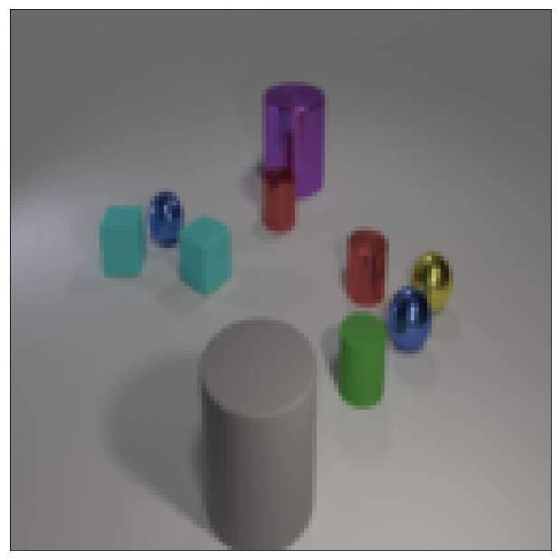        |   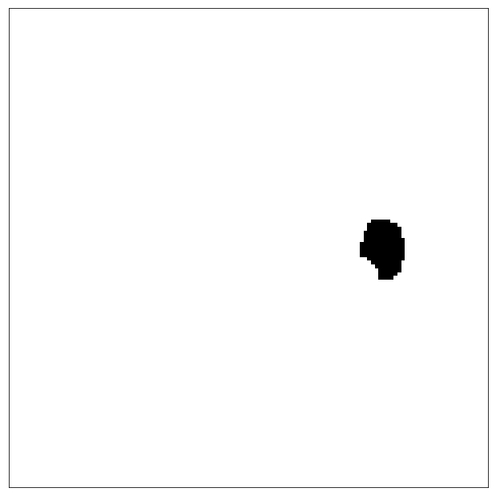  |     |
|  <sub>**LRP**</sub>  | <sub>**Integrated Gradients**</sub>  | <sub>**Guided Backprop**</sub> | <sub>**Grad-CAM**</sub> |
|  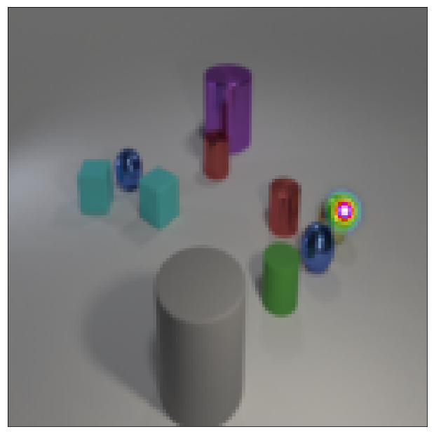   |  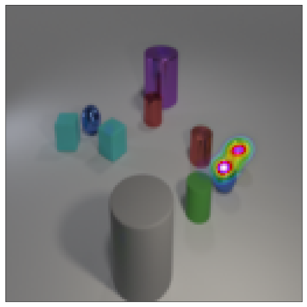   |  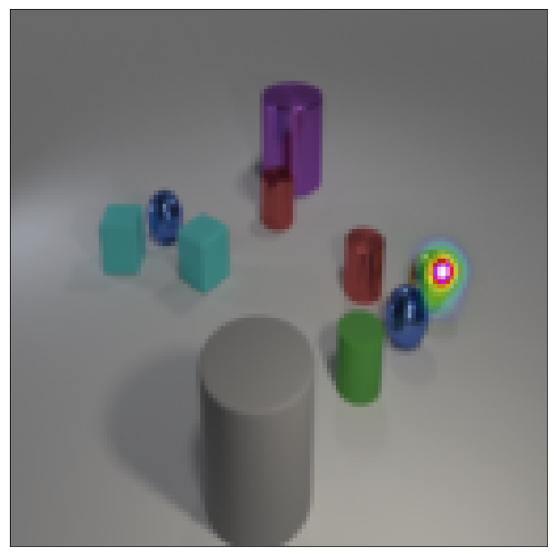   | 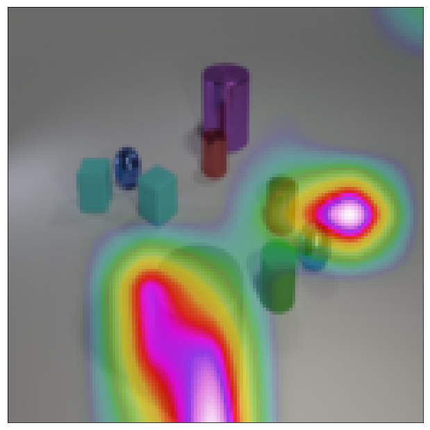   |


| <sub>CLEVR-XAI-complex</sub>  |  <sub>Image</sub>  |  <sub>GT Unique</sub> |  <sub>GT Unique First-non-empty</sub>  |
|:--------------------:|:-----------------------------------------:|:-----------------------------------------:|:-----------------------------------------:|
| **Is there any <br> other thing <br> that has the <br> same size as <br> the shiny <br> sphere?** <br> *yes*  | 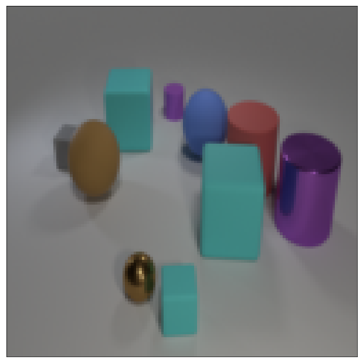        |   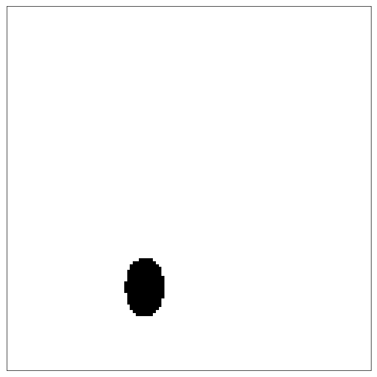  |   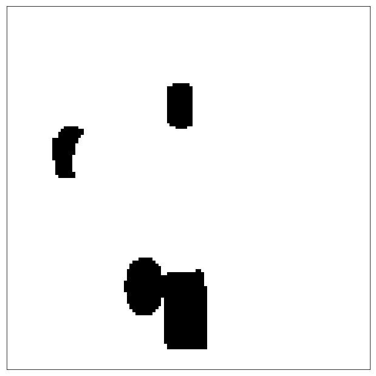  |
|  <sub>**LRP**</sub>  | <sub>**Integrated Gradients**</sub>  | <sub>**Guided Backprop**</sub> | <sub>**Grad-CAM**</sub> |
|  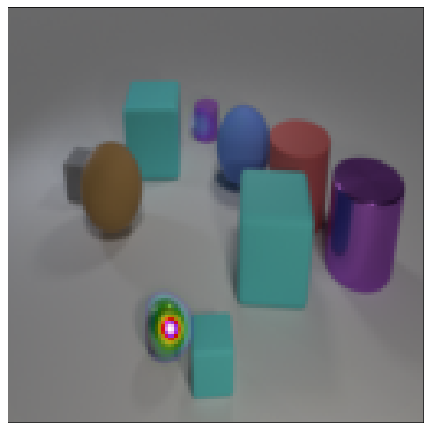   |  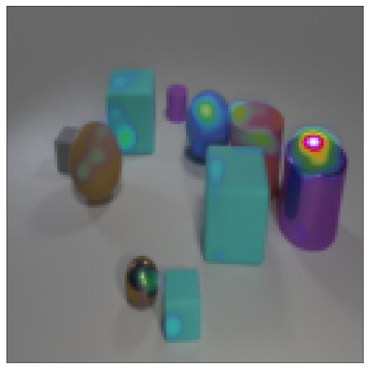   |  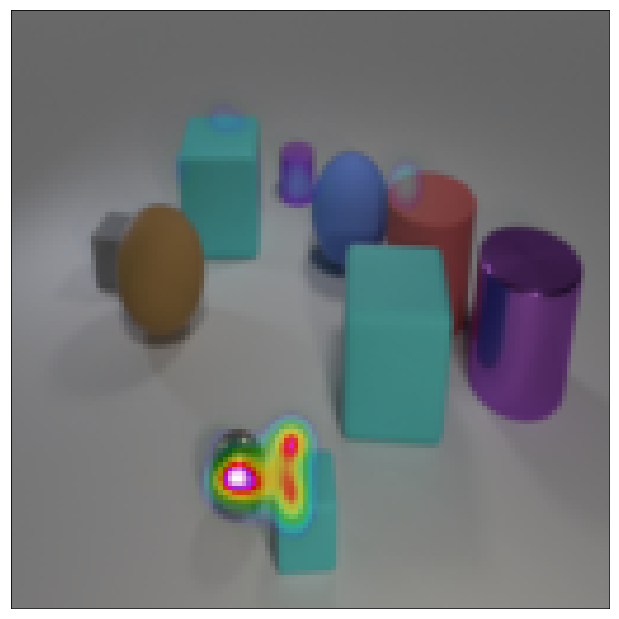   | 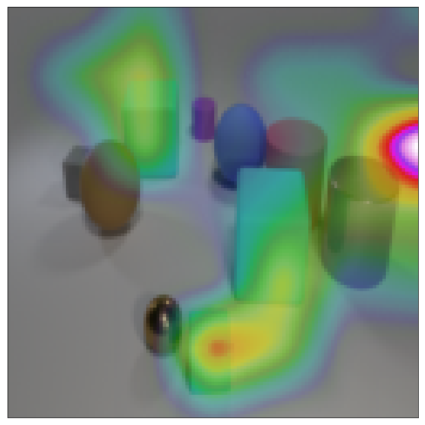   |


For more details on the definition of each GT please refer to the [paper](https://arxiv.org/abs/2003.07258). More broadly, note that simple questions always contain one target object for the VQA question, and complex questions can have several objects involved in the VQA question.


## I. Dataset Download

 
The dataset can be downloaded from the [releases](https://github.com/ahmedmagdiosman/clevr-xai/releases) section of this repository.


## II. Dataset Generation

For the sake of completeness and to promote future research, we additionally provide the code to generate the CLEVR-XAI dataset. Note that if you are only interested in using the released version of our dataset you don't need to re-generate the dataset yourself and can directly download it [here](https://github.com/ahmedmagdiosman/clevr-xai/releases), thus you can skip the following generation steps.

Our code to generate CLEVR-XAI is built upon the original [CLEVR generator](https://github.com/facebookresearch/clevr-dataset-gen/).

To limit the amount of prerequisites, all our generation steps run inside containers with [Singularity](https://sylabs.io/singularity/). So Singularity is the only requirement to run the code. Here is a Singularity [quick start guide](https://sylabs.io/guides/3.3/user-guide/quick_start.html).

### Step 1: Image Generation

Please refer to the README in the `image_generation` folder.

### Step 2: Question Generation

Please refer to the README in the `question_generation` folder.

### Step 3: Ground Truth Masks Generation

Please refer to the README in the `eval` folder. 

This last step also includes the resizing of the masks, which can be useful in case your model takes input images of a different size than the CLEVR images (the original CLEVR images have size 320x480).

In our released version of the CLEVR-XAI benchmark dataset, the masks were resized to the size 128x128 (since the Relation Network model we use for the evaluation of XAI methods takes input images of size 128x128), see our [paper](https://arxiv.org/abs/2003.07258) for more details on this step.


## III. Heatmap Generation

The code to generate heatmaps on a [Relation Network](https://papers.nips.cc/paper/2017/file/e6acf4b0f69f6f6e60e9a815938aa1ff-Paper.pdf) model which was trained on the original CLEVR dataset, and which was used to evaluate different XAI methods w.r.t. our CLEVR-XAI benchmark dataset, as done in the [paper](https://arxiv.org/abs/2003.07258), will be made publicly available upon paper publication (and at latest end of this year).


## IV. Heatmap Evaluation

The code to evaluate heatmaps is currently available as a stand-alone [gist](https://gist.github.com/ArrasL/0bc02ef98e369f861aec40145a58e356).

(In the future we may automatize this step and integrate it in the `eval` folder of this repository for more convenience.)


## Citation

If you find our dataset or code useful, please cite the following updated [paper](https://arxiv.org/abs/2003.07258)*:

```
@article{Arras_etal:2021,
    title     = {{Ground Truth Evaluation of Neural Network Explanations with CLEVR-XAI}},
    author    = {Leila Arras and Ahmed Osman and Wojciech Samek},
    journal   = {arXiv:2003.07258},
    year      = {2021},
    url       = {https://arxiv.org/abs/2003.07258}
}
```

(*In an [earlier version](https://arxiv.org/abs/2003.07258v1) of our work we considered only simple questions and the dataset was named simply-CLEVR: this dataset is identical to CLEVR-XAI-simple. This earlier version also contained less XAI methods in the benchmarking experiments)
